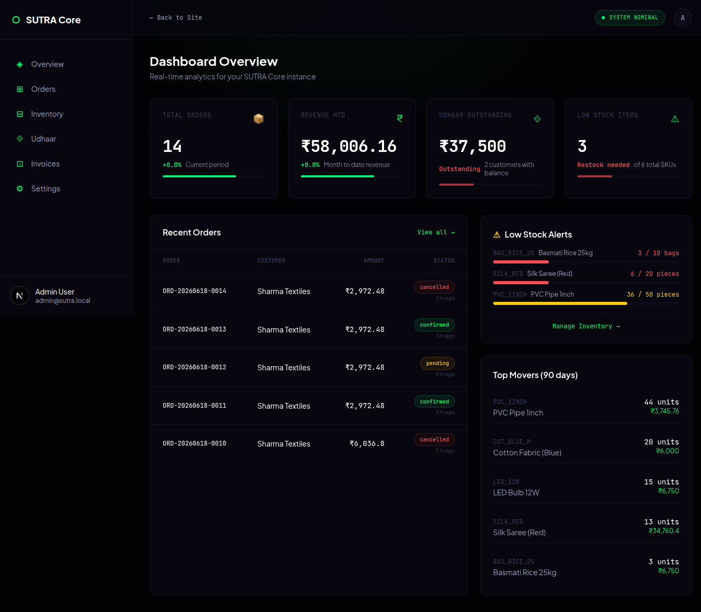
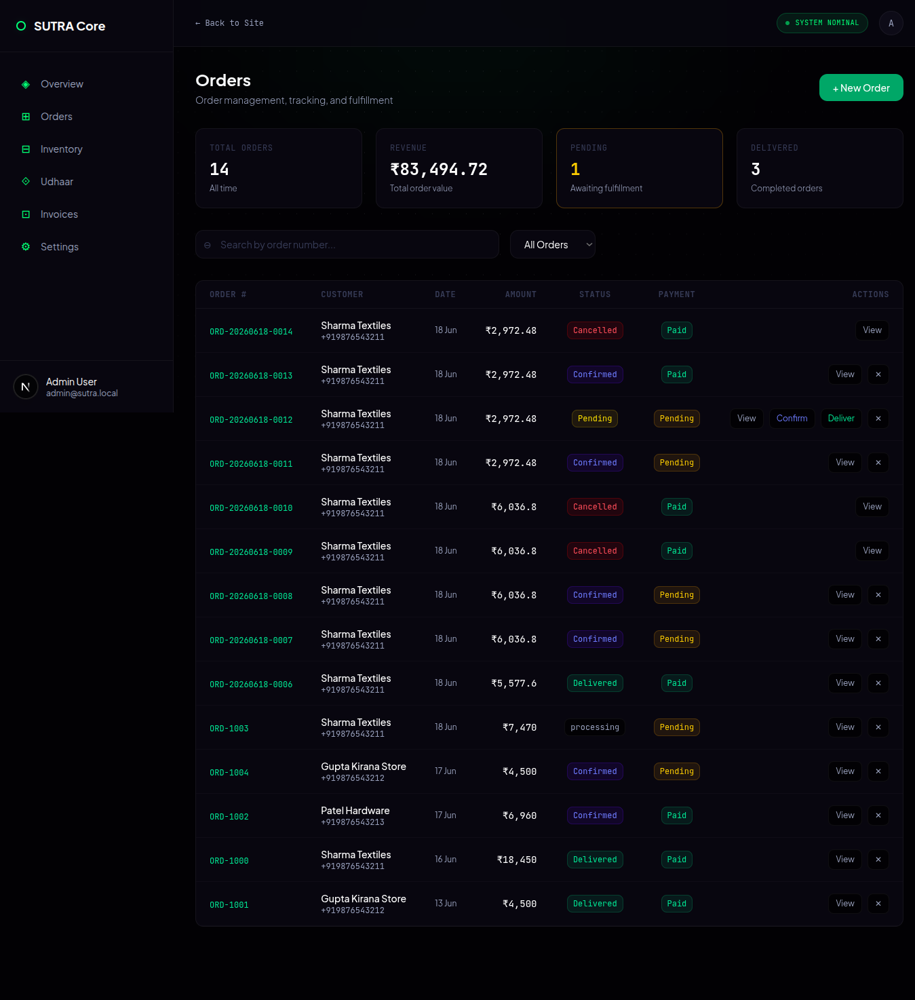
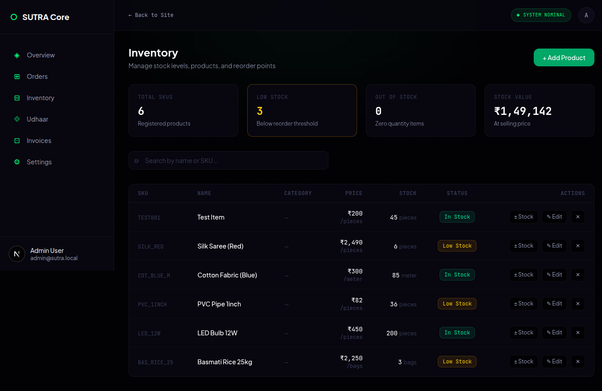
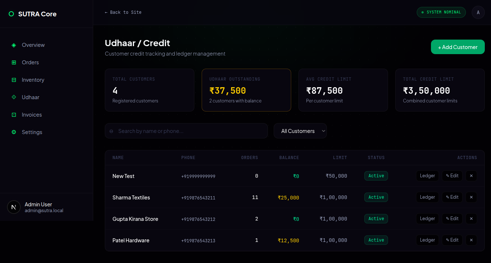
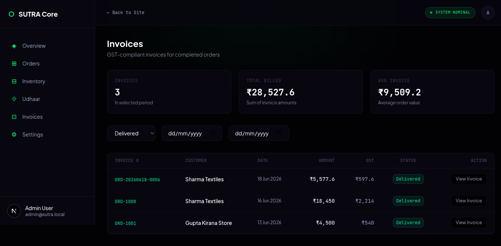
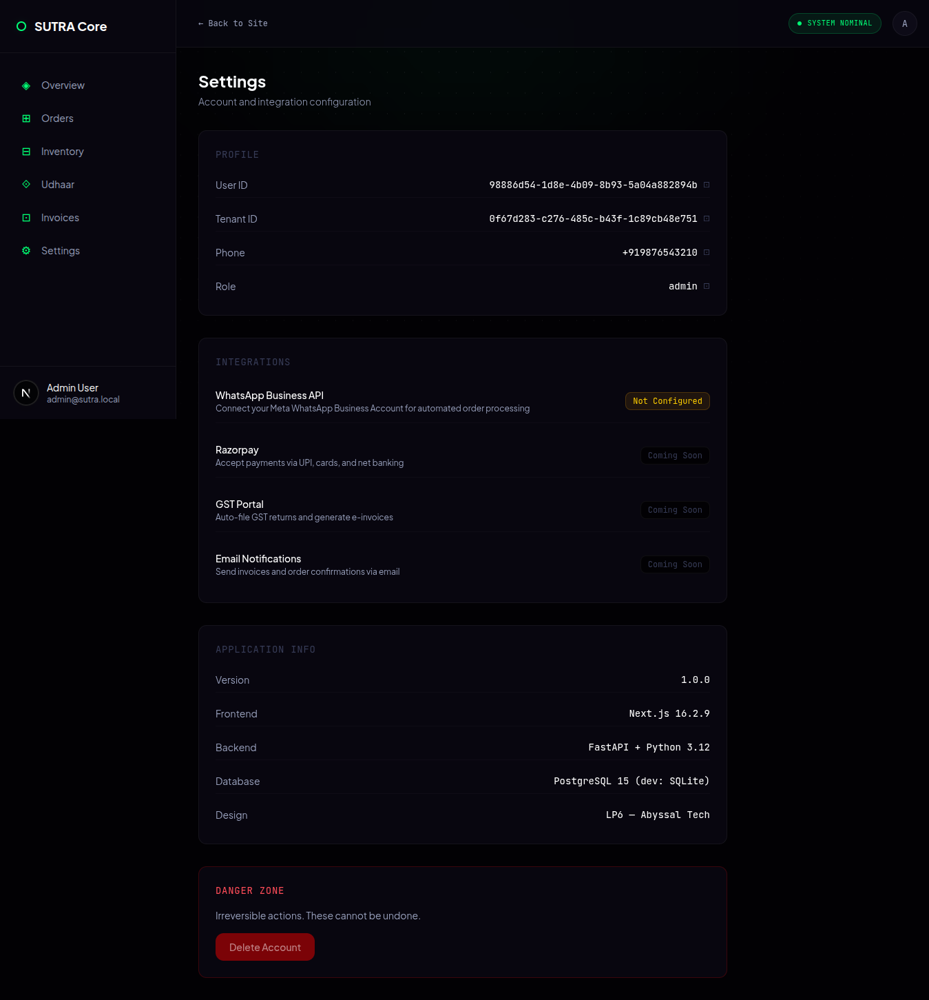

<p align="center">
  
</p>

<h1 align="center">SUTRA Core</h1>

<p align="center">
  <strong>AI-Powered WhatsApp ERP &amp; Order Management for India's 63 Million MSMEs</strong><br />
  Voice. Text. Hinglish. Zero training. Runs on a ₹800/month VPS.
</p>

<p align="center">
  <a href="https://github.com/ravikumarve/sutra-core/stargazers">
    
  </a>
  <a href="https://github.com/ravikumarve/sutra-core/forks">
    
  </a>
  <a href="LICENSE">
    
  </a>
  
  
  
  
  
  <a href="https://github.com/ravikumarve/sutra-core/actions">
    
  </a>
</p>

<p align="center">
  <code>📦 Inventory CRUD</code>
  <code>👥 Customer Mgmt</code>
  <code>📋 Order Pipeline</code>
  <code>💳 Udhaar Ledger</code>
  <code>🧾 GST Invoicing</code>
  <code>📊 Dashboard</code>
</p>

---

> **SUTRA** *(Systematic Unstructured Text & Resource Allocator)* — a textile merchant in Surat sends a Hinglish voice note; SUTRA transcribes, checks stock, confirms the order, deducts inventory, generates a GST invoice, and sends it back via WhatsApp. No app. No login. No training.

---

## ✨ Built & Working

| Module | What It Does | Status |
|--------|-------------|--------|
| **📦 Inventory CRUD** | Full inventory management — categories, stock adjustments, search, pagination, low-stock alerts | ✅ E2E tested |
| **👥 Customers CRUD** | Customer profiles, search, credit limit tracking | ✅ E2E tested |
| **📋 Orders Pipeline** | Create, confirm, deliver, cancel — auto inventory deduction/restore, credit ledger sync | ✅ E2E tested |
| **💳 Udhaar Ledger** | Credit transaction history, balance tracking per customer | ✅ Built |
| **🧾 GST Invoicing** | Line-item GST calculation, HSN-ready schema | ✅ Built |
| **📊 Dashboard** | Analytics dashboard — KPI cards, recent orders, inventory alerts, order management UI | ✅ 5 pages built |
| **🔐 Auth & RBAC** | JWT auth, role-based access, rate limiting, webhook security | ✅ Production-ready |
| **🎙️ Voice-to-Order** | Hinglish voice/text → Liaison → Strategist → Auditor pipeline | ✅ E2E verified |
| **🏢 Multi-Tenant** | Schema-level isolation, RLS policies, per-tenant encryption | ✅ Production-ready |

---

## 🖼️ Dashboard Preview

<div align="center">
  <table>
    <tr>
      <td align="center" width="33%"><br><b>📊 Overview</b><br><sub>KPI cards, recent orders, stock alerts</sub></td>
      <td align="center" width="33%"><br><b>📋 Orders</b><br><sub>Order lifecycle + auto inventory sync</sub></td>
      <td align="center" width="33%"><br><b>📦 Inventory</b><br><sub>CRUD, categories, low-stock alerts</sub></td>
    </tr>
    <tr>
      <td align="center" width="33%"><br><b>💳 Udhaar</b><br><sub>Credit ledger & customer balances</sub></td>
      <td align="center" width="33%"><br><b>🧾 Invoices</b><br><sub>GST-compliant invoicing</sub></td>
      <td align="center" width="33%"><br><b>⚙️ Settings</b><br><sub>Profile & integrations</sub></td>
    </tr>
  </table>
</div>

---

## 🚀 Quick Start (Dev — No Docker Required)

```bash
# 1. Clone & set up
git clone https://github.com/ravikumarve/sutra-core.git
cd sutra-core
python -m venv venv && source venv/bin/activate
pip install -r requirements.txt
cp .env.example .env

# 2. Run database migrations
alembic upgrade head

# 3. Seed demo data
python scripts/seed_demo.py

# 4. Start Redis (required for agent pipeline)
redis-server --daemonize yes

# 5. Start the API server
uvicorn src.main:app --host 0.0.0.0 --port 8000

# 6. (Separate terminal) Start the dashboard
cd frontend
npm install && npm run dev
```

**API docs** at [http://localhost:8000/docs](http://localhost:8000/docs)  
**Dashboard** at [http://localhost:3000/dashboard](http://localhost:3000/dashboard)  
**Login**: `+919876543210` / `password123`

### Run Tests

```bash
pytest tests/ -v           # 42 tests, all pass
pytest tests/ --cov=src    # coverage report
```

📖 [Full deployment guide →](docs/PRODUCTION_DEPLOYMENT_EXECUTION_GUIDE.md)

---

## 🧠 Architecture

```
                    ┌──────────────────────────────────────────────────┐
                    │                 SUTRA Core API                    │
                    │  (FastAPI, multi-tenant, JWT-authenticated)       │
                    │                                                  │
  ┌─────────┐       │  ┌──────────┐  ┌──────────┐  ┌──────────────┐  │       ┌──────────┐
  │         │       │  │Inventory │  │ Customers│  │   Orders     │  │       │          │
  │ Mobile /│ HTTP  │  │  CRUD    │  │  CRUD    │  │   CRUD       │  │  JWT  │  Next.js │
  │ Desktop │──────►│  ├──────────┤  ├──────────┤  ├──────────────┤  │◄─────►│Dashboard │
  │         │       │  │ Stock    │  │ Udhaar   │  │ GST Calc     │  │       │  (5 pgs) │
  └─────────┘       │  │ Adjust   │  │ Ledger   │  │ Inv Deduct   │  │       └──────────┘
                    │  └──────────┘  └──────────┘  └──────┬───────┘  │
                    │                                     │           │
                    │  ┌───────────────────────────────────▼────────┐ │
                    │  │         Agent Pipeline (Redis-driven)      │ │
                     │  │  ┌────────┐  ┌───────────┐  ┌─────────┐   │ │
                     │  │  │Liaison │─►│Strategist │─►│ Auditor │   │ │
                     │  │  └────────┘  └───────────┘  └─────────┘   │ │
                     │  │     ✓ E2E verified — no error loops        │ │
                    │  └────────────────────────────────────────────┘ │
                    │                                                  │
                    │  WhatsApp Webhook ◄──► Meta Cloud API            │
                    └──────────────────────────────────────────────────┘
```

## 🛠️ Technology Stack

| Layer | Technology |
|-------|-----------|
| **API Framework** | FastAPI (Python 3.12+) — async, auto-docs, Pydantic v2 |
| **Frontend** | Next.js 16 + Tailwind v4 + shadcn/ui |
| **Database** | PostgreSQL 15 (multi-tenant) / SQLite (dev) |
| **Auth** | JWT with refresh tokens, HTTP Bearer, RBAC |
| **Queue** | Redis Streams (per-tenant namespaced, consumer groups) |
| **STT** | OpenAI Whisper (CPU, Hinglish post-processing) |
| **Monitoring** | Prometheus + Grafana + Alertmanager |
| **CI/CD** | GitHub Actions (lint → test → security scan → deploy) |
| **Deployment** | Docker Compose / systemd |

---

## 📊 Architecture Decisions

| Decision | Why |
|----------|-----|
| **WhatsApp-first, no native app** | Shop owners live on WhatsApp. Zero adoption friction. |
| **PostgreSQL over NoSQL** | Financial ledger requires ACID. Udhaar entries must be atomic with inventory. |
| **Redis Streams over Kafka** | Single ₹800/month VPS. Kafka is overkill. Redis handles comfortably. |
| **Column snapshots in API responses** | Avoids SQLAlchemy async greenlet errors after `db.commit()` — all response data captured before commit. |
| **UUID conversion for JWT user_id** | PostgreSQL asyncpg requires `uuid.UUID` objects for UUID columns, not strings. JWT `user_id` is converted before DB queries. |
| **ERROR message type terminates pipelines** | Prevents infinite error bounce loops between agents (observed: 925 msg/sec without this guard). |
| **CPU-only Whisper** | 30s async latency is acceptable for WhatsApp. No GPU = deployable anywhere. |

---

## 🔄 End-to-End Flows (Verified)

### Agent Pipeline (Redis-driven)

```text
TEXT ("Mujhe 2 kg chai chahiye")
  → LIAISON (extracts intent: inquiry, entities)
    → STRATEGIST (validates business logic)
      → AUDITOR (audit trail, pipeline complete)
```

Three agents communicate via **Redis Streams** (per-tenant namespaced, consumer groups). No agent calls another directly — all communication is through `AgentMessage` objects, ensuring independent scaling and restart.

### Order CRUD

```text
POST /orders          → ORD-20260618-0012 created (status: pending)
                      → Inventory deducted: SILK 6→5, PVC 36→34
PUT /orders/{id}      → Status: confirmed
PUT /orders/{id}      → Status: delivered, payment: paid
DELETE /orders/{id}   → Cancelled, inventory restored: SILK 5→6, PVC 34→36
```

---

## 📈 Roadmap

| Feature | Status |
|---------|--------|
| Inventory & Customers CRUD | ✅ `v1.0.0` Live |
| Orders CRUD + GST invoicing | ✅ `v1.0.0` Live |
| Udhaar ledger & credit tracking | ✅ `v1.0.0` Live |
| Analytics dashboard (5 pages) | ✅ `v1.0.0` Live |
| Auth, RBAC, rate limiting | ✅ `v1.0.0` Live |
| Multi-tenancy (schema isolation) | ✅ `v1.0.0` Live |
| CI/CD + Monitoring stack | ✅ `v1.0.0` Live |
| Multi-agent pipeline (Liaison → Strategist → Auditor) | ✅ `v1.0.0` Live — E2E verified |
| Whisper-Hinglish NLP pipeline | ✅ `v1.0.0` Implemented (needs API key) |
| WhatsApp webhook integration | ✅ `v1.0.0` Handlers ready |
| Image-based order parsing (photo → SKU) | 📋 Planned `v1.1` |
| UPI payment link injection | 📋 Planned `v1.1` |
| Fine-tuned Whisper for 8 regional accents | 📋 Planned `v1.2` |

---

## 💰 Pricing Model

| Plan | Price | For |
|------|-------|-----|
| **Starter** | ₹499/month | 1 WhatsApp number, 500 orders/mo |
| **Growth** | ₹1,499/month | 3 numbers, 2K orders/mo, 3 users |
| **Business** | ₹4,999/month | Unlimited, dedicated support, custom integrations |

Self-hosted is **MIT licensed and free**. Paid plans include managed hosting, SLA, and priority support.

---

## 📖 Documentation

| Document | Description |
|----------|-------------|
| [Deployment Guide](docs/PRODUCTION_DEPLOYMENT_EXECUTION_GUIDE.md) | Step-by-step production setup |
| [Security Hardening](docs/PRODUCTION_SECURITY_HARDENING.md) | Production security measures |
| [Monitoring Setup](docs/PRODUCTION_MONITORING_SETUP.md) | Prometheus + Grafana guide |
| [Backup Procedures](docs/PRODUCTION_BACKUP_PROCEDURES.md) | Backup & disaster recovery |
| [Runbooks](docs/PRODUCTION_RUNBOOKS.md) | Operational runbooks |
| [Executive Summary](docs/EXECUTIVE_SUMMARY.md) | Business overview |

---

## 🤝 Contributing

We actively welcome contributions in these high-impact areas:

- **Dialect Maps** — Hinglish vocabulary, regional terms, unit aliases
- **Industry Presets** — New business-type configs (electronics, furniture, etc.)
- **Test Audio Fixtures** — Real Hinglish voice note transcriptions
- **Query Optimizations** — PostgreSQL performance with EXPLAIN ANALYZE

See [CONTRIBUTING.md](CONTRIBUTING.md) for detailed guidelines.

---

## 📄 License

MIT — see [LICENSE](LICENSE).

Built for the bazaar. Runs in the background. Never misses a bill.

---

<p align="center">
  
</p>
